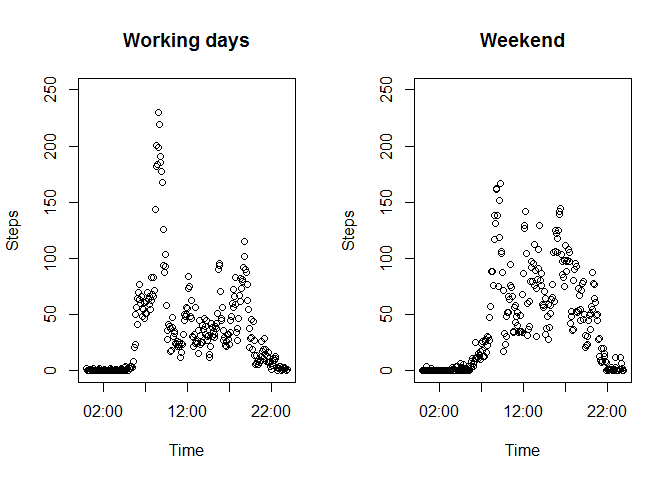

# Reproducible Research: Peer Assessment 1

###Loading and preprocessing the data###

First, we need to load the data. We assume that the file is already downloaded. Also, we assume that it is located in the working directory. Then we convert date values to *date* format.


```r
unzip("activity.zip")
data <- read.csv("activity.csv")
data$Date<-as.Date(data$date, format="%Y-%m-%d")
```

###What is mean total number of steps taken per day?###

Now we need to calculate the total number of steps taken per day. We will use *aggregate* function for this task.


```r
agg.date <- aggregate(x=data$steps, by=list(data$Date), FUN=sum, na.rm=TRUE)
names(agg.date) <- c("Date", "steps")
hist(agg.date$steps, xlab="Steps per day", main="Steps per day distribution")
```

 

Then we take mean and median of daily values:


```r
mean(agg.date$steps)
```

```
## [1] 9354.23
```

```r
median(agg.date$steps)
```

```
## [1] 10395
```

###What is the average daily activity pattern?###

Now let's look at how the number if steps changes during a day (we take interval averages for all days). Intervals are converted to *time*. 


```r
agg.interval <- aggregate(x=data$steps, by=list(data$interval), FUN=mean, na.rm=TRUE)
names(agg.interval)=c("interval", "steps")
agg.interval$steps <- round(agg.interval$steps)
library(lubridate)
agg.interval$time<-parse_date_time(agg.interval$interval, c("%H%M", "%M"))
plot(agg.interval$time, agg.interval$steps, type="l", ylab="Steps", xlab="Time", main="Average daily activity pattern")
```

 

Next task is to find the largest number of steps and determine when it happened.


```r
max <- which.max(agg.interval$steps)
max
```

```
## [1] 104
```

```r
max.interval <- agg.interval[max, 1]
max.interval
```

```
## [1] 835
```

```r
max.steps <- agg.interval[max, 2]
max.steps
```

```
## [1] 206
```

As we see, maximum number of steps is 206 and it occurs at 835 interval.

###Imputing missing values###

Let's check whether we have missing values in our dataset.


```r
sum(is.na(data$steps))
```

```
## [1] 2304
```

Since we do have missing values, let's replace them with a mean for respective interval.


```r
data.na <- data
agg.na <- aggregate(x=data$steps, by=list(data$interval), FUN=mean, na.rm=TRUE)
for (i in 1:nrow(data.na))
    {
    if (is.na(data.na[i, 1]))
        {
        data.na[i, 1] <- round(agg.na$x[agg.na$Group.1==data.na[i, 3]])    
        }
    }
agg.na.date <- aggregate(x=data.na$steps, by=list(data.na$Date), FUN=sum)
names(agg.na.date) <- c("Date", "steps")
hist(agg.na.date$steps, xlab="Steps per day", main="Steps per day distribution (no NAs)")
```

 

Again, we take mean and median of daily values:


```r
mean(agg.na.date$steps)
```

```
## [1] 10765.64
```

```r
median(agg.na.date$steps)
```

```
## [1] 10762
```

###Are there differences in activity patterns between weekdays and weekends?###


```r
Sys.setlocale("LC_TIME", "US") 
```

```
## [1] "English_United States.1252"
```

```r
data.na$weekend <-ifelse((weekdays(data.na$Date)=="Saturday" | weekdays(data.na$Date)=="Sunday"), 1, 0)
workday<-data.na[data.na$weekend==0, ]
weekend<-data.na[data.na$weekend==1, ]

agg.workday <-aggregate(x=workday$steps, by=list(workday$interval), FUN=mean)
names(agg.workday) <- c("interval", "steps")
agg.workday$time<-parse_date_time(agg.workday$interval, c("%H%M", "%M"))

agg.weekend <-aggregate(x=weekend$steps, by=list(weekend$interval), FUN=mean)
names(agg.weekend) <- c("interval", "steps")
agg.weekend$time<-parse_date_time(agg.weekend$interval, c("%H%M", "%M"))

par(mfrow=c(1,2))
plot(agg.workday$time, agg.workday$steps, ylim=c(0, 250), xlab="Time", ylab="Steps", main="Working days")
plot(agg.weekend$time, agg.weekend$steps, ylim=c(0, 250), xlab="Time", ylab="Steps", main="Weekend")
```

 

We can see that activity distribution during a day differs on type of a day. On working days people get up earlier, then commute (some part of commuting is walking), walk a bit during their work, then get back home (in the evening they are tired that's walk less and take public transportaion). During weekend, people get up later, walk a lot during a day, and the distribution of activity is more even. Local minima are probably associated with meals.   
